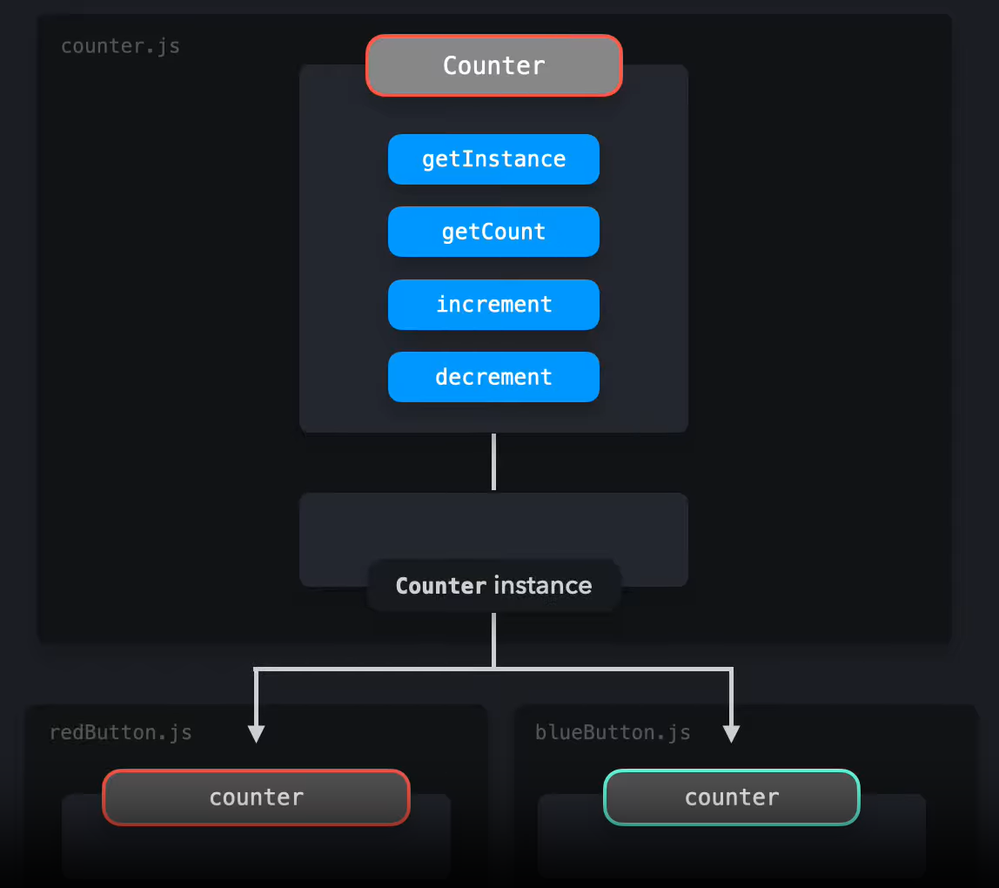

*Design patterns are a fundamental part of software development, they provide typical solutions to commonly recurring problems in software design.*

## Following the Flow of the Program

Programming without a plan is like going into an airport with no destination. There's plenty of opportunities and options to choose from, but unless you have some idea of where you want to end up you can just be getting further from your goal. Github Projects has helped organize myself and my team in a way that sets clear goals through each issue, and the early templates gave us all a clear idea of the final destination.

With the final destination in mind, a design template is like a trip itinerary. It organizes your path to your destination in a way that people can follow, build on, and most importantly actually use. Unlike a trip itinerary but just as important, a design pattern needs to provide answers to recurring problems such that the same problem doesn't need to be solved twice.

## Design Patterns Per Github Issue

Obviously each of us in our team have a unique way of programming, but have similar goals. Early on when our issues are to create Pages and visuals, our code barely overlapped. So we could each design our pages as we seemed fit, while fitting a common theme. So pertaining to my own design Patterns, I find myself following a Singleton Design pattern very closely. I tend to create most functions and schemas from outside the file of interest. This helps stay more organized and see the bigger picture.

The big picture is very important cause I want to ensure my code is legibile and usable in other implementations. The short term goal of creating a page quickly but leads to more repeating, or less legible code then I feel there's a lack of planning taking place on my part. As well, planning ahead on future issues as we intend to implement new features code should be easy to build upon. For me personally the Singleton Design strategy is efficient and with proper comments or communication, should be easy for others to pick up where you leave off.

Then when you need to use the code it's very simple. After importing the appropriate file portion it's just calling said function, schema, or collection. It's important to keep up with my team and have an idea of what they've done so I can properly use their own work. 

