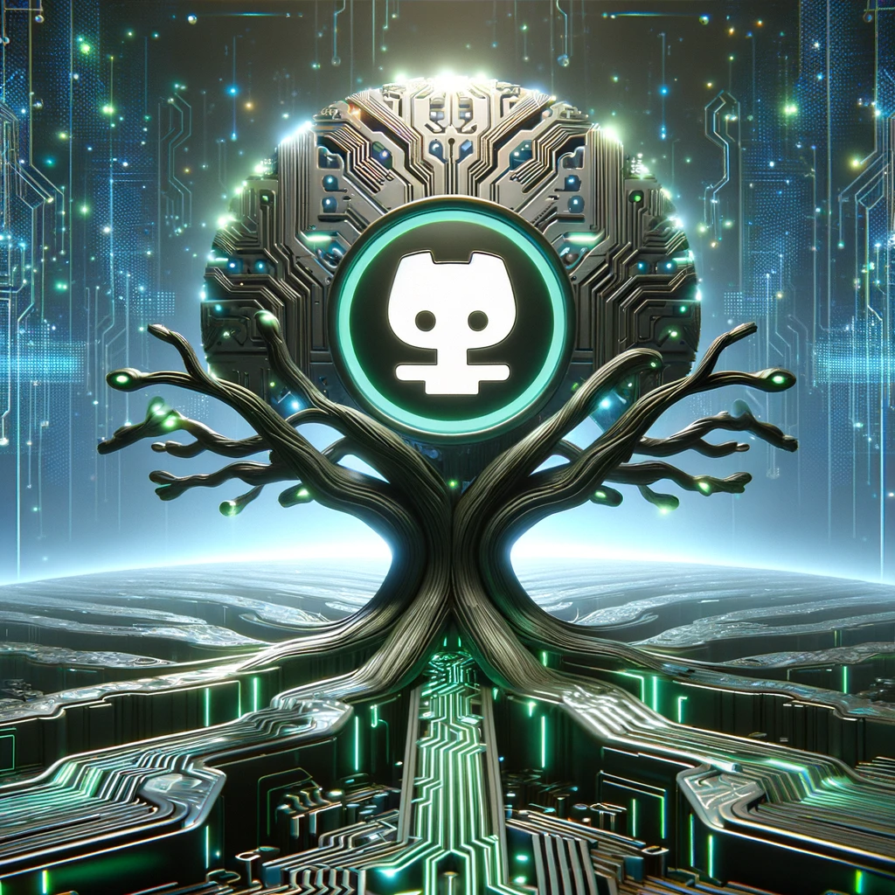

### I. Introduction
ICS 314 was the class about Software Engineering. Now that I'll be finishing this class very soon, this is my essay reflecting back on the semester but moreso what I've learned and how I learned. For starters, I enjoyed this class greatly. It wasn't just interesting in topic, but also the way it taught. I learned a little bit more about how I prefer to learn and what software engineering is about. I wish I did a bit better and was more consistent but regardless of the outcome, it's one of the few classes I enjoyed going to class for as it would challenge in the right way.

### II. Experiences & WODS
For starters looking back at all the Experiences or homework assignments. It was very funny how they'd repeat the same problem everytime we were trying to learn a new tool. Helped me appreciate how each tool does it differently, and that of course I'd never make a website from just HTML. As well, splitting assignments up into parts and see the progression of our work was very helpful to appreciate what we're learning. Having the professors guide us to solve the problem and at times require us to do it once more. The downfall with this approach is that at times I would miss a singular assignment and then it would have part 2 through 6 leading ahead of it. I laugh at it now but it was frustrating to work back through a problem and not get points for it. It was a very busy semester so I don't blame anyone but myself for those just something funny to look back on.

Moving on to WOD's, they were not as scary as I expected. I wasn't one of the few that passed every WOD but apart from a couple I did pass them all. They were simple and relatively straight forward, I wouldn't really change anything about the WOD system as it is now. Enjoyable portion of the class while stressful.

### IV. What I'd Change 
A small change I'd make to better prepare for the project. More examples on working with collections and maybe giving some freedom to do something creative using collections and linking them in class. 

### V. What I Learned
I could list everything I learned as it was all new but I'll stick to the big ones. I'd never coded in Java script before this class so it was nice to try a new language especially after coding in C for a while in other classes it was a very nice change of pace. I learned how to use Github better and the Github desktop app appropriately. Working within teams setting milestones, issues, and the system of slowly iterating and slowly getting to our goal was satisfying, working in a team makes things move much quicker for sure. Web development and design, I'd thought about it but seeing many different ways to do it, I view all the websites I visit with a whole new lense. As well of the integration of intelliJ with github was just very fun to set up and something I hope to use more in the future.

As well the Ethics involved in Computer science in general. I think life is unfair but we each need to look and try our best to not give preferential treatment. It's easy to see someone doing it and argue they're doing wrong, but it really counts once we're in their shoes, and always strive to do the right thing.

### VI. Conclusion:
To summarize, this was by far one of the most fun classes in my college career. Seeing as I'll be graduating, I got to take a very valuable professional portfolio from it and even helped me land a job. I recommend this class to anyone and the time commitment isn't too difficult. There's very little I'd change and overall enjoyed my time. I used AI for the image to demonstrate Github is at the core of lots of communication and I honestly find it incredible how it works.