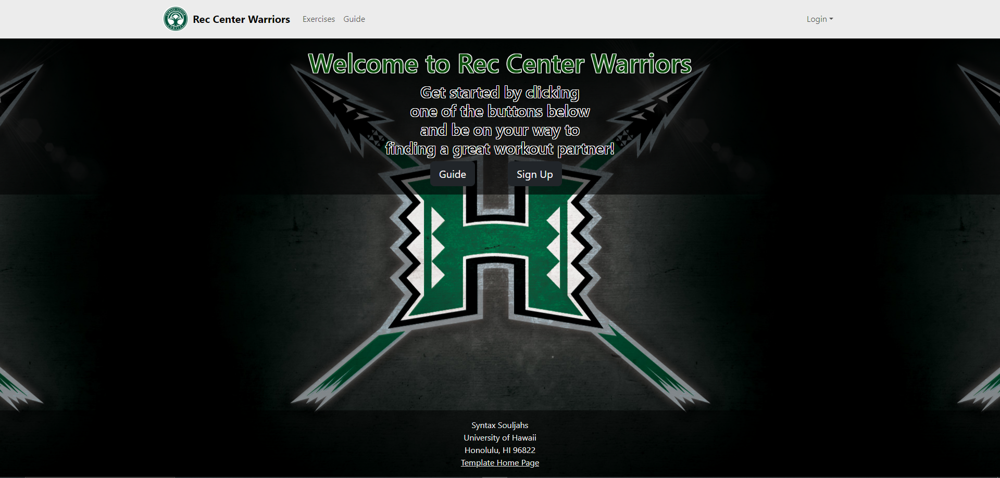
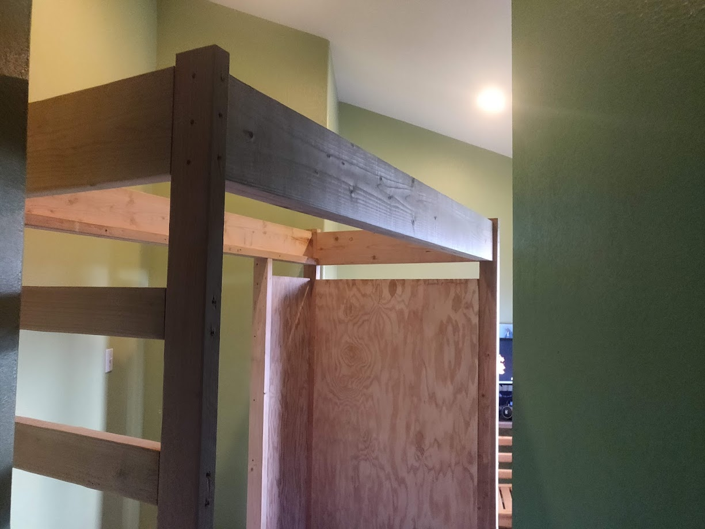

  
  

## Inspiration
This was a personal project of mine I did in 2020. At the peak of the pandemic I found myself with lots of time on my hands, and also a very cramped room. It fit a small desk and a bed with barely any walking space. So one night I started making a very rough design for bunk bed on fusion 360. I knew nothing about standard wood sizes so I began researching about wood sizes, prices, and general strength. It was very interesting to learn how 2 by 4's are actually 1.5 by 3.5 inches and that this pattern was very consistent across every wood size. From there I measured my room and thought of all the different combinations to explore. There really wasn't many viable orientations since my room is shaped like a reverse Z tetris block. So once I had all the measurements I needed and had a rough idea of what I wanted to gain from the bunkbed I moved to fusion 360 and began designing.

## Design Phase
I began with the legs, everything would essentially have to be built off the legs as I didn't plan on screwing anything into the studs in the wall. At this point I've had experience with fusion 360 making knick knacks with my 3d printer. This was my first attempt at designing something of this scale and not meant to be 3d printed. Now that I had an idea of where I wanted the 4 pillar legs I began thinking what sort of wood I'd use for bracing and giving my bed structure. Seeing as my room was cramped as it was I opted to build the ladder into the frame out of the frame giving it lots of rigidity. Next I wanted lots of space for storing things like clothes, knick knacks, and board games. So after lots of different variations I opted to just use plywood walls to enclose the shelves and split them in the middle by connecting them to an extra 2 by 4 leg which would provide additional bracing to my actual bed. After taking all the measurements and comparing to what wood sizes they have at the store I came up with a shopping list and cut list that would result with as little left over materials. Then began the actual building process.

# Building
Building the bunkbed wasn't too difficult. Thankfuly I have access to a drop and table saw to help cut the large plywood pieces. By getting the measurements straight from fusion 360 and cutting everything to size first, we assembled everything inside the room it would stay in. Minor adjustments were made, like the edition of 2 extra legs to help brace the 2 large plywood pieces in the back. Before assembling I sanded down all the wood, and once assembled applied a few coats of wood finish. I was very happy with the final result which gave me lots of extra storage space for clothes and knick knacks. My twin size bed fit very snug, and it was over.

