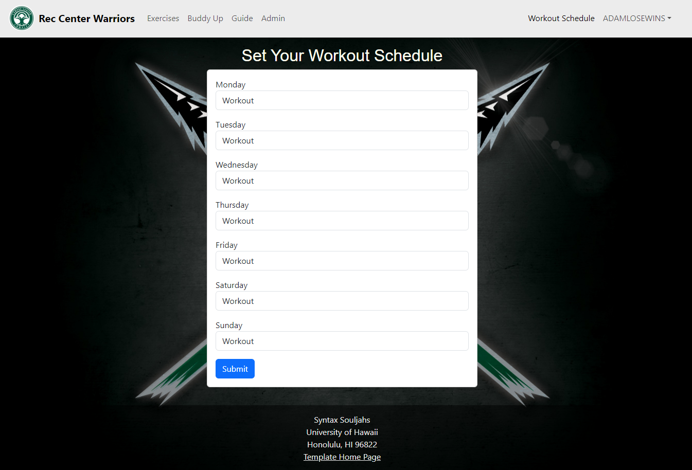

  
  

## Introduction
The goal of Rec Center Warrior was to create a hub for like minded gym goers to find spot or work out partners to make working ou more enjoyable. As well to hopefully start a community of people that could help the others achieve their goals. To do this we wanted to make it easy for people to insert their schedule and find others wih similar exercises on those days.

## Design Phase
Looking back at the start we were very ambitious, which isn't necessarily a bad thing, but clearly we weren't as prepared as we believed. The ambition also had its place as it helped us figure out what we wanted and what we needed. As well as the end goal of things which later led to a very clean step by step process. Rarely or ever did we have to walk features back, to change them into something else. After brainstorming looking at example programs online and getting some website ideas from chatgpts image generator we began work.

## Collaboration Phase
Before we could begin anything though we needed to ensure we could collaborate and integrate our separate work seamlessly. This was my second time working through github desktop but I must say it worked much more seamlessly this time and I'm amazed at the technology behind it. Due to the structure of the assignment being split into milestones, we could start easy for milestone one making the framework for our website. Creating mock up pages and implementing a bare minimum for what would be held in each page. Logging our progress and making it public on the home page made it satisfying to see how far we've gone. We had our fair share of merge conflicts and growing pains learning how to use Github desktop but by far I've learned more about team work and github through this project more then any other.

## Understanding Collections
My important job was to create collections to link to each profile. By doing so we could find the best match of people for each given day of the week. We had made a specific page for this with a drop down for each specific type of workout you wanted for the day. Some examples being "Push", "Pull", "Cardio", "Legs". After hitting submit it would pull the filled out table and do a collection.insert into the WorkoutScheduleCollection. Each collection would be linked to the user the submitted and could now look for available work out partners.

## What I learned
I learned a lot about working as a team in a coding environment. It was very interesting to see how my peers would solve problems and at times it made it easier to follow their lead and try to follow their style towards the goal. Going back to my own code and seeing how others edited or used it was also satisfying and I'm sure I couldn't have done it alone. Learning to use github I think will be an invaluable experience and one that I'm sure I'll use in my future. learning how to effectively use collections, and creating the visuals on a website was also an enjoyable yet stressful experience. Overall I hope I get the opportunity to work in a team like this again, especially when I have much less classes taking up my time and I can really put my all.

