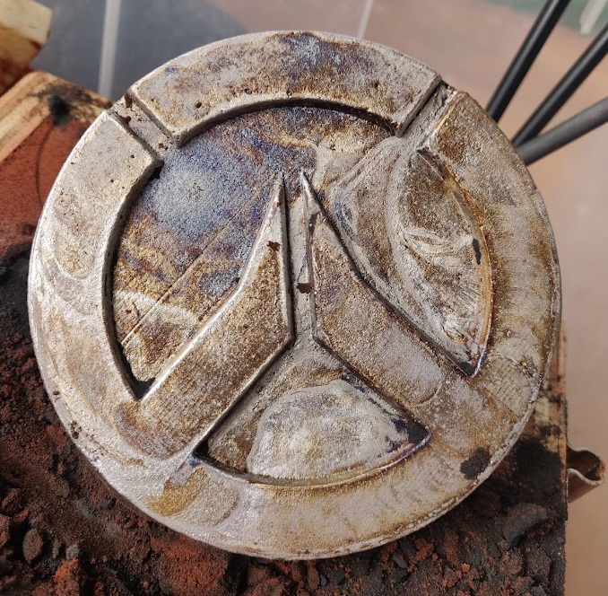

## Inspiration
Around the summer of 2022 I really got into these youtube videos where people would go into junkyards, find appliances, and strip them of as much metal as possible. There was this real powerful feeling of heating up something so hot it melts and you make it into something of your own. I've been really into manufacturing for a while, my favorite being additive manufacturing otherwise known as 3d printing. I've researched and look into metallic 3d printers for a while but they're all quite expensive and use special metallic powders that are very dangerous to breath in. So I researched and came up with multiple possible ways each with their own pros and cons.

## Method One
The first way was to apply multiple layers of a very high temperature resistant coating, mixed with metal wires wrapped around it kind of acting like rebar in concrete. You'd add a spout to your design beforehand that would be coated as well, except for the very top portion. Lots of layers and drying later you're left with a very high resistant and strong mold, only problem is there's a 3d print inside it and if it's at all intricate then there's no way of physically pulling it out without breaking your solid coating. The answer is to hang in a furnace with the spout down and increasing the temperature to 285+ degrees Celcius will result in the 3d print turning into a liquid and flowing out. Then you take out the hot mold which is just a negative of whatever print was inside and pour in your molten metal. The issues that I found with this method is that there's a lot of downtime since you need to wait 30 minutes to an hour for the coating to dry before you can apply a new one. As well, the heat resistant coating would often crack and leak out the molten metal due to the heat shock. Lastly taking out the mold requires a tedious process of taking apart the layers of coating and metal which can also take a long time.

## Method Two
The Second method, my preferred method, is to use special sand that can withstand the very high temperatures of the molten aluminum. By constructing a 2 piece wooden frame that fit together usually with wooden jigs. I couldn't quite make the wood jig method work as it was inconsistent and wouldn't always line up which is important, why it is i'll explain later. So I opted for a pair of securty slide latch locks at different positions on each side so they only fit one way everytime. And as added percaution, I also designed my own key to fit between 2 aluminum L shapes to lock them in them vertically together. Once that's in place, you get your 3d print and cover and pound it in sand. when you're done you can flip over and remove the 3d print which leads to the greatest fault of this method. As you need to remove the 3d print without disturbing the sand, it can't be a very intricant 3d model, limiting it signifcantly to mostly 2d shapes, and required me to design and print my own mechanism to consistently remove the 3d print fluidly and perfectly up. Once all those individual problems are solved you are left with a negative of the print. The 2 wooden pieces need to slide in the same spot everytime because you don't want open air aluminum on the bottom as this creates a very ugly top finish. Instead you'll create a flat sand piece with 2 pour holes for trapped air to exit and fill everything in fully. If they're misalign, then it can give the final product a very visible shift or mirror affect for just half the mold.

## Selling
After Iterating design after design and being able to comfortably create molds quickly without messing up, I created my own Etsy page to sell the coin. To make the coin more visually I also designed a special stand for it that satisfyling sits on curve. With an overall Overwatch theme to the stand as well. Eventually I got my first order which was for 5 coins as a present for all 5 of the groomsmen. They even went as far to leave a satisfying 5 star review about how they liked the finish.

## What I learned
This project helped me experience the iterative nature of making mechanical parts and going through the protoyping stage. Also giving me lots more experience using fusion 360 and I'm constantly learning how to use new tools or existing tools in smarter ways. As well this gave me a good feel for what it's like to create a sells page and how to improve and price my time and work.
