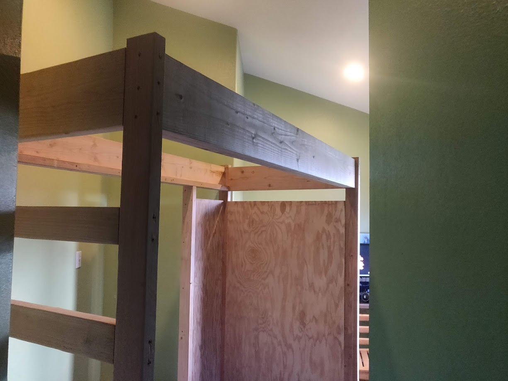

Around the summer of 2022 I really got into these youtube videos where people would go into junkyards, find appliances, and strip them of as much metal as possible. There was this real powerful feeling of heating up something so hot it melts and you make it into something of your own. I've been really into manufacturing for a while, my favorite being additive manufacturing otherwise known as 3d printing. I've researched and look into metallic 3d printers for a while but they're all quite expensive and use special metallic powders that are very dangerous to breath in. So I researched and came up with multiple possible ways each with their own pros and cons.

The first way was to apply multiple layers of a very high temperature resistant coating, mixed with metal wires wrapped around it kind of acting like rebar in concrete. You'd add a spout to your design beforehand that would be coated as well, except for the very top portion. Lots of layers and drying later you're left with a very high resistant and strong mold, only problem is there's a 3d print inside it and if it's at all intricate then there's no way of physically pulling it out without breaking your solid coating. The answer is to hang in a furnace with the spout down and increasing the temperature to 285+ degrees Celcius will result in the 3d print turning into a liquid and flowing out. Then you take out the mold which is just a negative of whatever print was inside and pouring in your 

I began with the legs, everything would essentially have to be built off the legs as I didn't plan on screwing anything into the studs in the wall. At this point I've had experience with fusion 360 making knick knacks with my 3d printer. This was my first attempt at designing something of this scale and not meant to be 3d printed. Now that I had an idea of where I wanted the 4 pillar legs I began thinking what sort of wood I'd use for bracing and giving my bed structure. Seeing as my room was cramped as it was I opted to build the ladder into the frame out of the frame giving it lots of rigidity. Next I wanted lots of space for storing things like clothes, knick knacks, and board games. So after lots of different variations I opted to just use plywood walls to enclose the shelves and split them in the middle by connecting them to an extra 2 by 4 leg which would provide additional bracing to my actual bed. After taking all the measurements and comparing to what wood sizes they have at the store I came up with a shopping list and cut list that would result with as little left over materials. Then began the actual building process.

  

