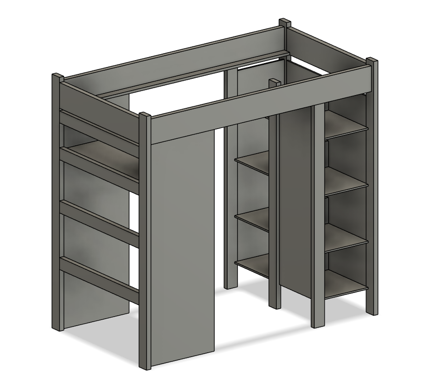

  
  

This was a personal project of mine I did in 2020. At the peak of the pandemic I found myself with lots of time on my hands, and also a very cramped room. It fit a small desk and a bed with barely any walking space. So one night I started making a very rough design for bunk bed on fusion 360. I knew nothing about standard wood sizes so I began researching about wood sizes, prices, and general strength. It was very interesting to learn how 2 by 4's are actually 1.5 by 3.5 inches and that this pattern was very consistent across every wood size. From there I measured my room and thought of all the different combinations to explore. There really wasn't many viable orientations since my room is shaped like a reverse Z tetris block. So once I had all the measurements I needed and had a rough idea of what I wanted to gain from the bunkbed I moved to fusion 360 and began designing.

I began with the legs, everything would essentially have to be built off the legs as I didn't plan on screwing anything into the studs in the wall. At this point I've had experience with fusion 360 making knick knacks with my 3d printer. This was my first attempt at designing something of this scale and not meant to be 3d printed. Now that I had an idea of where I wanted the 4 pillar legs I began thinking what sort of wood I'd use for bracing and giving my bed structure. Seeing as my room was cramped as it was I opted to build the ladder into the frame out of the frame giving it lots of rigidity. Next I wanted lots of space for storing things like clothes, knick knacks, and board games.

