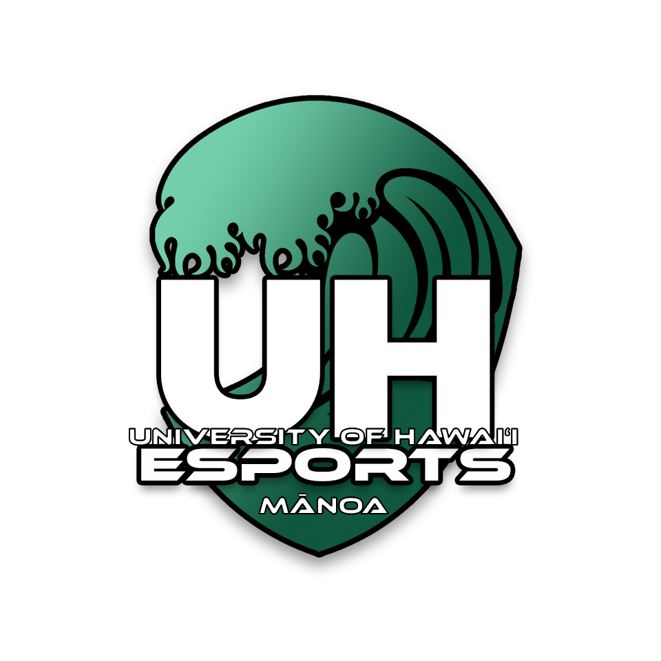

 

I joined UH Esports in May 2020, right after graduating from Highschool and I recently got my acceptance letter from Leeward, the UH Esports overwatch coach reached out to me from a friend of a friend and asked me to try out for the team. Fast forward a year later, that coach who was also managing the team leaves because he found a paid position which UH Esports could not offer. He then entrusted me to lead the team starting the summer of 2021 and it was a totally knew experience for me. It helped me appreciate the work of managers, and learn a lot of leadership skills. Of course certain skills I learn managing an overwatch team isn't necessarily applicable to every leadership scenario, but it's helped me understand what it takes to lead a team, and learn from my mistakes. Over time our team became more recognized and UH Esports became a much bigger and more organized organization. We were voted as the best Collegiate Organization in the nation in 2022 by "Esports Awards", and my team and I managed to catch the eye of sponsors and become the first and currently only scholarship funded team in UH Esports. Of course with funding such as this, we were under more pressure not as much for performance and doing good, but to represent the organization as a respectful group that strives for success.

In April of 2023 we qualified and traveled to a LAN tournament in Boise, Idado. We managed to get full funding from the University of Hawaii, for the airbnb, travel, and food costs. I was responsible for organizing travel, lodging, and crafting a daily itinerary with places to eat, and what we'd be doing every hour. On top of that, in charge of calculating individual expenses which would then be submitted to the University to determine how much funding we'd receive. Overall traveling went very smoothly we had no hiccups and stayed right at around our budget. 

Overall the experience I have gained as a Capain of a Collegiate team has been priceless. From organizing meetings, finding and communicating with other collegiate or non-collegiate teams for scrimmages or partnerships, updating the UH Esports director with goals and accomplishments every semester, and overall team management skills to keep my team motivated and organized.

